# miniGen: A 2D Playground for Generative Models

Generative modeling is probability distribution mapping in essense.

<table>
  <tr>
    <td align="center" width="12.5%">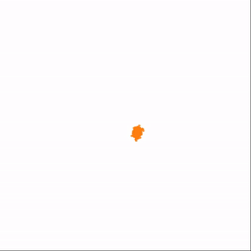</td>
    <td align="center" width="12.5%"></td>
    <td align="center" width="12.5%"></td>
    <td align="center" width="12.5%"></td>
    <td align="center" width="12.5%"></td>
    <td align="center" width="12.5%"></td>
    <td align="center" width="12.5%"></td>
    <td align="center" width="12.5%">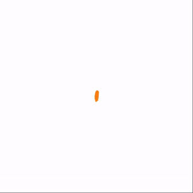</td>
  </tr>
</table>

This is a minimalist, modular playground for training and visualizing generative models on 2D synthetic data (source distribution → target distribution). Built for rapid experimentation, prototyping, and learning, it helps me stay current with new generative modeling ideas. The focus is on core algorithmic logic, which largely carries over to production systems; most real-world differences stem from scale and training refinements. 

## Visualization

### Distribution Matching Process

Below are visualizations showing how distribution matching evolves during training across different generative modeling paradigms/methods.

<table>
  <tr>
    <td align="center" width="20%"><sub><b>Variational<br>Autoencoder</b></sub><br>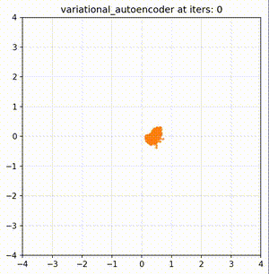</td>
    <td align="center" width="20%"><sub><b>GAN<br>&nbsp;</b></sub><br>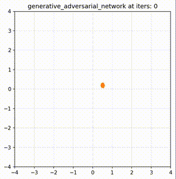</td>
    <td align="center" width="20%"><sub><b>Energy-Based<br>Model</b></sub><br>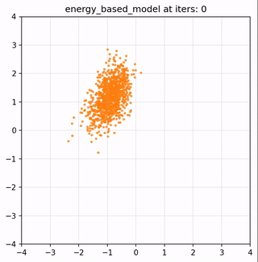</td>
    <td align="center" width="20%"><sub><b>Autoregressive<br>Model</b></sub><br>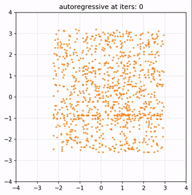</td>
    <td align="center" width="20%"><sub><b>Score Matching<br>(Hyv&auml;rinen)</b></sub><br>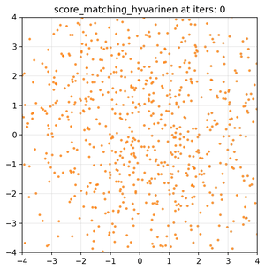</td>
  </tr>
  <tr>
    <td align="center" width="20%"><sub><b>Score Matching<br>(NCSN)</b></sub><br>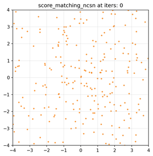</td>
    <td align="center" width="20%"><sub><b>Diffusion<br>(DDPM)</b></sub><br>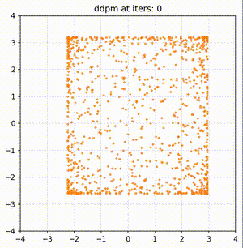</td>
    <td align="center" width="20%"><sub><b>Normalizing<br>Flow</b></sub><br>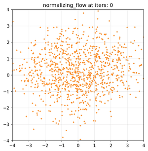</td>
    <td align="center" width="20%"><sub><b>Continuous<br>NF</b></sub><br>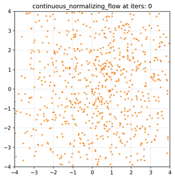</td>
    <td align="center" width="20%"><sub><b>(Rectified) Flow<br>Matching</b></sub><br>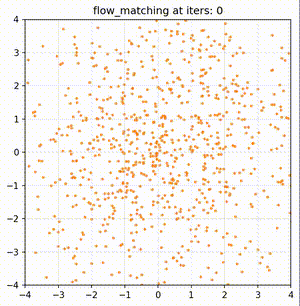</td>
  </tr>
  <tr>
    <td align="center" width="20%"><sub><b>Consistency<br>Training</b></sub><br>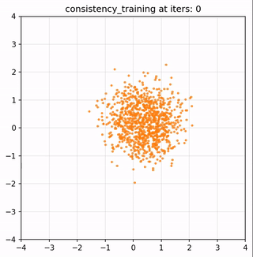</td>
    <td align="center" width="20%"><sub><b>Shortcut<br>Model</b></sub><br>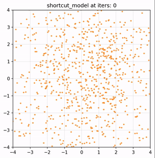</td>
    <td align="center" width="20%"><sub><b>Improved<br>MeanFlow</b></sub><br>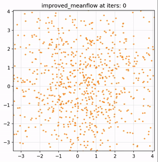</td>
    <td align="center" width="20%"><sub><b>Alpha<br>Flow</b></sub><br>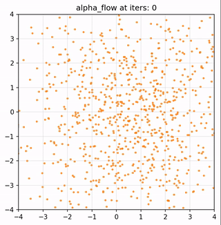</td>
    <td align="center" width="20%"><sub><b>Drifting<br>Model</b></sub><br>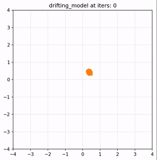</td>
  </tr>
</table>


### The Score Fields (Score-based Models)

Visualizing the learned score fields over different training iterations.

<table>
  <tr>
    <td align="center" width="33%"><sub><b>Score Matching<br>(Hyv&auml;rinen)</b></sub><br>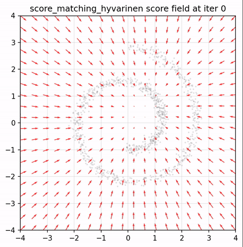</td>
    <td align="center" width="33%"><sub><b>Score Matching<br>(NCSN)</b></sub><br>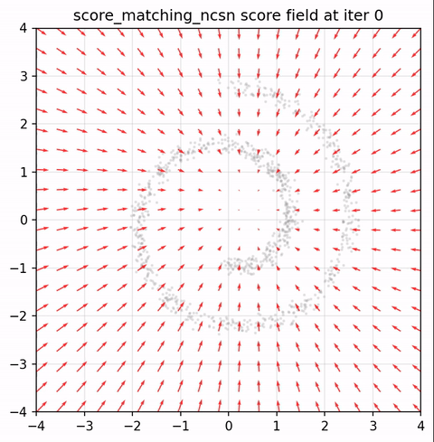</td>
    <td align="center" width="33%"><sub><b>Diffusion<br>(DDPM)</b></sub><br>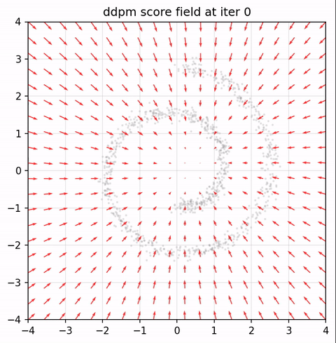</td>
  </tr>
</table>


### The Velocity Fields (Flow Models)

Visualizing the learned velocity fields over different training iterations.

<table>
  <tr>
    <td align="center" width="33%"><sub><b>Continuous<br>Normalizing Flow</b></sub><br>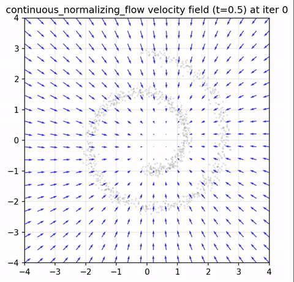</td>
    <td align="center" width="33%"><sub><b>(Rectified) Flow<br>Matching</b></sub><br>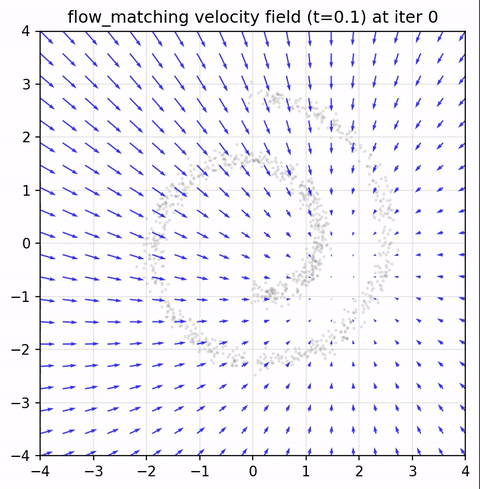</td>
    <td align="center" width="33%"><sub><b>Improved<br>MeanFlow</b></sub><br>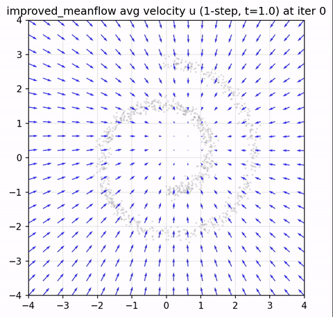</td>
  </tr>
</table>


### The Drift Fields (Drifting Model)

Visualizing the "drifting" motion at inference time.

<table>
  <tr>
    <td align="center" width="33%"><sub><b>Swiss Roll<br>&nbsp;</b></sub><br>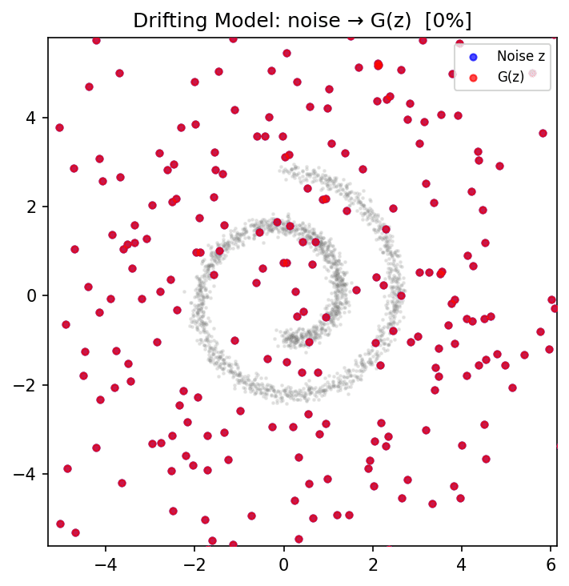</td>
    <td align="center" width="33%"><sub><b>Gaussian Mixture<br>&nbsp;</b></sub><br>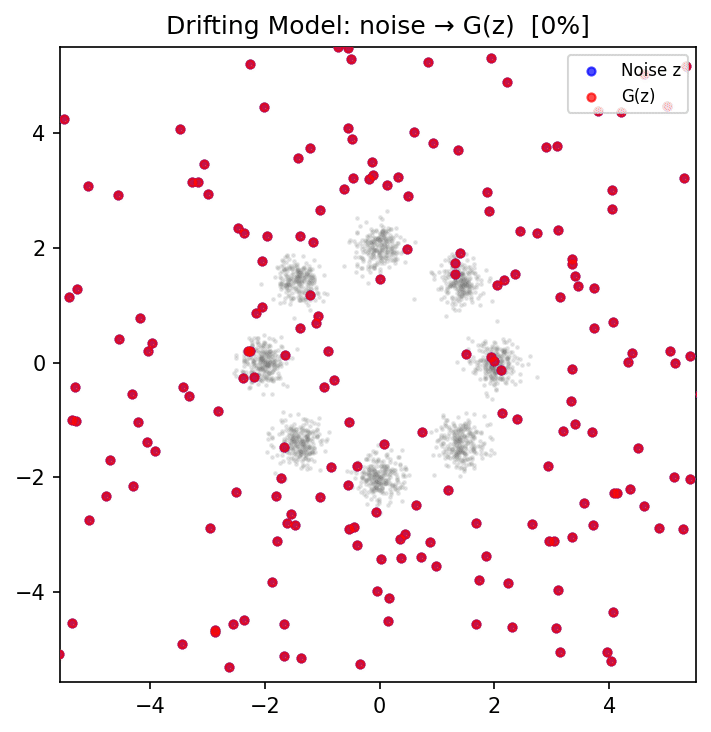</td>
    <td align="center" width="33%"><sub><b>Checkerboard<br>&nbsp;</b></sub><br>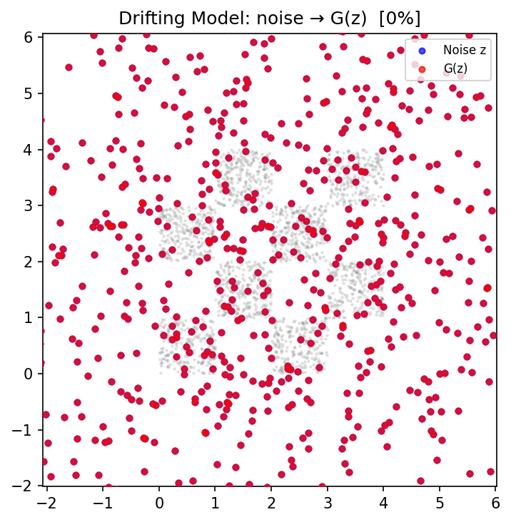</td>
  </tr>
</table>

The drifting model performs one-step generation:
- Blue dots represent randomly initialized points
- Red dots represent the drifted outputs of the model
- Green lines visualize their one-step drifting process or trajectories.

## Usage

### Training

Train any model by pointing to its config:

```bash
python train.py --config configs/flow_matching/FlowMatching_MLP_SwissRoll.yaml
```

Override config values from the command line:

```bash
python train.py --config configs/diffusion/DDPMSampler_MLP_SwissRoll.yaml training.total_steps=5000
```

Add `--skip_save_ckpt` to skip saving checkpoints.

Configs are organized as `configs/{paradigm}/{Model}_{Arch}_{Dataset}.yaml`. Each config specifies the model type, architecture, dataset, training hyperparameters, and inference settings.

### Supported Models

Currently 18 generative modeling paradigms are supported — see `paradgims/` for the full list.

### Datasets

Nine 2D synthetic distributions: `swiss_roll`, `gaussian_mixture`, `moons`, `circles`, `checkerboard`, `spirals`, `pinwheel`, `rings`, `s_curve`.

### Outputs

Training outputs are saved to `logs/{timestamp}_{exp_name}/`:
- `train.log` — training metrics (step, loss, lr, throughput)
- `saved_images/` — sample visualizations at regular intervals
- `saved_checkpoints/` — model checkpoints
- `visualize.html` — interactive image gallery

## Quick Start

This project uses [uv](https://docs.astral.sh/uv/) for environment management.

```bash
uv sync
```

This installs all dependencies (PyTorch, NumPy, matplotlib, OmegaConf, tqdm) into a local `.venv`. The PyTorch wheel is platform-aware: CUDA-enabled on Linux (x86_64), CPU+MPS on macOS (Apple Silicon).

Then run training with:

```bash
uv run python train.py --config configs/flow_matching/FlowMatching_MLP_SwissRoll.yaml
```

## Requirements

- Python 3.10+
- [uv](https://docs.astral.sh/uv/) (recommended) or pip
- PyTorch, NumPy, matplotlib, OmegaConf, tqdm (managed by `pyproject.toml`)
