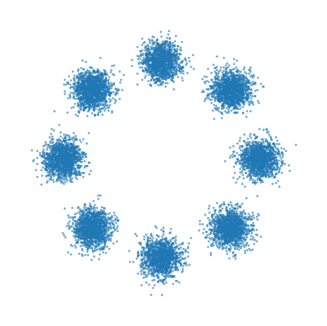
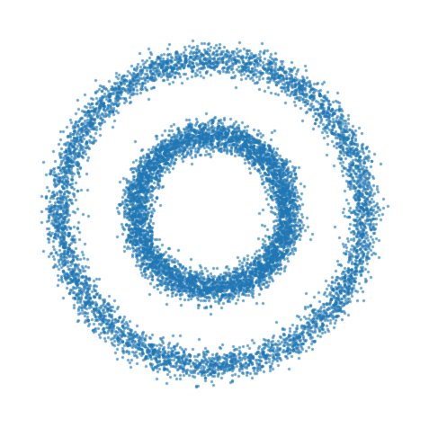

# 2D Synthetic Datasets

Nine 2D synthetic distributions are supported. All data is normalized to [-1, 1].

<table>
  <tr>
    <td align="center" width="33%"><b>Swiss Roll</b> </td>
    <td align="center" width="33%"><b>Gaussian Mixture</b> </td>
    <td align="center" width="33%"><b>Moons</b> </td>
  </tr>
  <tr>
    <td align="center" width="33%"><b>Circles</b> </td>
    <td align="center" width="33%"><b>Checkerboard</b> </td>
    <td align="center" width="33%"><b>Spirals</b> </td>
  </tr>
  <tr>
    <td align="center" width="33%"><b>Pinwheel</b> </td>
    <td align="center" width="33%"><b>Rings</b> </td>
    <td align="center" width="33%"><b>S-Curve</b> </td>
  </tr>
</table>
